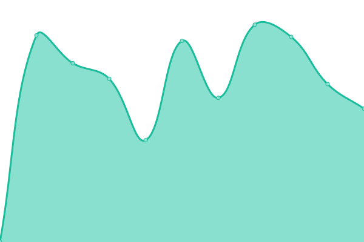

# [📈 Live Status](https://status.alexnuttinck.dev): <!--live status--> **🟩 All systems operational**

This repository contains the open-source uptime monitor and status page for [Alexandre Nuttinck](https://alexnuttinck.dev), powered by [Upptime](https://github.com/upptime/upptime).

With [Upptime](https://upptime.js.org), you can get your own unlimited and free uptime monitor and status page, powered entirely by a GitHub repository. We use [Issues](https://github.com/alexnuttinck/upptime/issues) as incident reports, [Actions](https://github.com/alexnuttinck/upptime/actions) as uptime monitors, and [Pages](https://status.alexnuttinck.dev) for the status page.

<!--start: status pages-->
<!-- This summary is generated by Upptime (https://github.com/upptime/upptime) -->
<!-- Do not edit this manually, your changes will be overwritten -->
<!-- prettier-ignore -->
| URL | Status | History | Response Time | Uptime |
| --- | ------ | ------- | ------------- | ------ |
|  [Alexandre Nuttinck website](https://alexnuttinck.dev) | 🟩 Up | [alexandre-nuttinck-website.yml](https://github.com/alexnuttinck/status-page/commits/HEAD/history/alexandre-nuttinck-website.yml) | 

 226ms
     
 | 

<a href="https://status.alexnuttinck.dev/history/alexandre-nuttinck-website">100.00%</a>
    

|  [Le Pressoir](https://www.lepressoir.be/) | 🟩 Up | [le-pressoir.yml](https://github.com/alexnuttinck/status-page/commits/HEAD/history/le-pressoir.yml) | 

 702ms
     
 | 

<a href="https://status.alexnuttinck.dev/history/le-pressoir">100.00%</a>
    

|  [La fete des vignerons](https://lafetedesvignerons.be) | 🟩 Up | [la-fete-des-vignerons.yml](https://github.com/alexnuttinck/status-page/commits/HEAD/history/la-fete-des-vignerons.yml) | 

 982ms
     
 | 

<a href="https://status.alexnuttinck.dev/history/la-fete-des-vignerons">100.00%</a>
    

<!--end: status pages-->

[**Visit our status website →**](https://status.alexnuttinck.dev)

## 📄 License

- Powered by: [Upptime](https://github.com/upptime/upptime)
- Code: [MIT](./LICENSE) © [Alexandre Nuttinck](https://alexnuttinck.dev)
- Data in the `./history` directory: [Open Database License](https://opendatacommons.org/licenses/odbl/1-0/)
